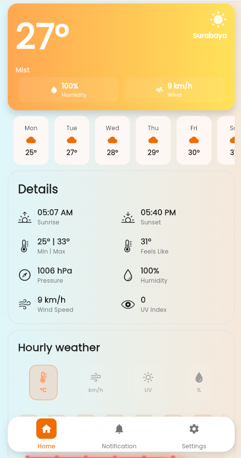
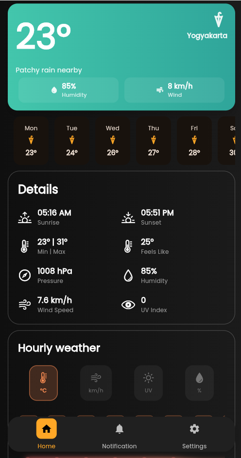

## 📸 Preview Aplikasi





# 🌦️ Weather App (Flutter)

Weather App adalah aplikasi cuaca berbasis **Flutter** yang menampilkan informasi cuaca secara **real-time**. Proyek ini dibuat sebagai latihan penerapan koneksi internet, API, dan pengolahan data JSON dengan tampilan sederhana dan modern.

---

## ✨ Fitur Utama
- 🌍 Informasi cuaca real-time
- 🔌 Menggunakan koneksi internet
- 📱 UI sederhana dan responsif

### 🎨 Fitur Tambahan
- Welcome / Get Started Screen
- Light Mode & Dark Mode
- Bottom Navigation Bar  
  - Home  
  - Notification  
  - Settings  

---

## 🛠️ Teknologi
- Flutter
- Dart
- REST API (Weather)
- HTTP / Retrofit

---

## ▶️ Cara Menjalankan Proyek

### 1. Install Dependency
```powershell
flutter pub get
